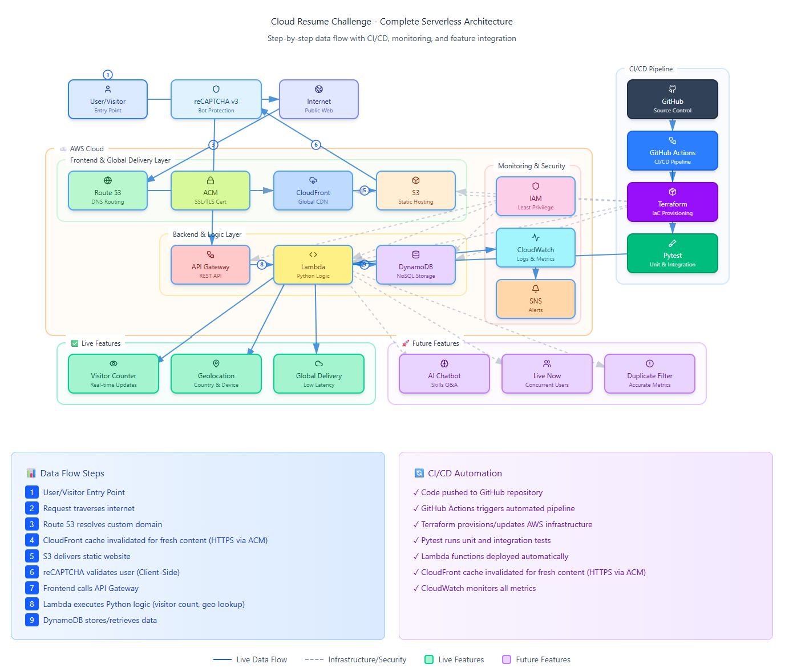

## ☁️ Cloud Resume Challenge - AWS Edition (Extended)

A serverless cloud resume with visitor counter, geolocation tracking, and bot protection using AWS services and Infrastructure as Code.


## 🎯 Project Overview

This project implements the [Cloud Resume Challenge](https://cloudresumechallenge.dev/) by Forest Brazeal with additional features:


- ✅ Static website hosted on **AWS S3**
- ✅ HTTPS distribution via **CloudFront CDN**
- ✅ Visitor counter API with **API Gateway + Lambda**
- ✅ Data storage in **DynamoDB**
- ✅ DNS management with **Route 53**
- ✅ **Infrastructure as Code** with Terraform
- ✅ **IP geolocation** with interactive map
- ✅ **reCAPTCHA v3** bot protection
- ✅ **Comprehensive unit tests**


## 🏗️ Architecture

```
User → Route 53 → CloudFront → S3 (Static Website)
                      ↓
                  API Gateway → Lambda (Python)
                                  ↓
                            DynamoDB

External APIs:
  - Google reCAPTCHA (bot protection)
  - ipinfo.io / ip-api.com (geolocation)
```


## Full Architecture Diagram ## 
                                            




## 📁 Project Structure

```
cloud-resume/
├── resume_front_end/          # Frontend (HTML/CSS/JS)
│   ├── index.html             # Main page
│   ├── app.js                 # JavaScript logic
│   ├── style.css              # Styles
│   └── images/                # Assets
│
├── resume_back_end/           # Backend (Python Lambda)
│   ├── lambda_function.py     # Main Lambda code
│   ├── test_lambda_function.py   # Unit tests
│   ├── requirements-test.txt  # Test dependencies
│   
│
├── terraform/                 # Infrastructure as Code
│   ├── main.tf                # Main Terraform config
│   ├── variables.tf           # Input variables
│   ├── outputs.tf             # Output values
│   ├── README.md              # Terraform guide
│   └── modules/               # Reusable modules
│       ├── s3/                # S3 bucket module
│       ├── cloudfront/        # CloudFront module
│       ├── lambda/            # Lambda module
│       ├── api_gateway/       # API Gateway module
│       ├── dynamodb/          # DynamoDB module
│       └── route53/           # Route 53 module
│
└── README.md                  # This file


```


## 🛠️ Technologies Used

### Frontend
- HTML5, CSS3, JavaScript
- Leaflet.js (interactive maps)
- Google reCAPTCHA v3

### Backend
- Python 3.12
- AWS Lambda
- AWS API Gateway
- AWS DynamoDB
- External APIs (ipinfo.io, ip-api.com)

### Infrastructure
- AWS S3
- AWS CloudFront
- AWS Route 53 (optional)
- AWS IAM
- AWS CloudWatch
- Terraform (IaC)

### Testing
- pytest
- unittest


```


## 🛡️ Security Features

### reCAPTCHA v3 Bot Protection

- Invisible bot detection (no challenges for users)
- Scores requests 0.0 (bot) to 1.0 (human)
- Blocks requests with score < 0.5


### AWS Security Best Practices

- S3 bucket access via CloudFront OAI only
- Lambda least-privilege IAM role
- HTTPS enforcement via CloudFront
- Environment variables for secrets
- DynamoDB encryption at rest
- CloudWatch logging for audit trail


## 💰 Cost

Estimated monthly costs with moderate traffic:

| Service | Monthly Cost |
|---------|-------------|
| CloudFront | ~$0.05 |
| S3 | ~$0.03 |
| API Gateway | ~$0.35 |
| Lambda | ~$0 (Free Tier) |
| DynamoDB | ~$0.25 |
| Route 53 (optional) | ~$0.50 |
| reCAPTCHA | **FREE** |
| **Total** | **$1-2/month** |


## 🎓 Skills Demonstrated

- ✅ **Cloud Architecture** - Serverless design
- ✅ **Frontend Development** - HTML/CSS/JS
- ✅ **Backend Development** - Python, Lambda
- ✅ **Infrastructure as Code** - Terraform
- ✅ **DevOps** - CI/CD, automation
- ✅ **Security** - Bot protection, IAM, HTTPS
- ✅ **Testing** - Unit tests, integration tests
- ✅ **API Integration** - Third-party services
- ✅ **Documentation** - Comprehensive guides
- ✅ **Cost Optimization** - Resource efficiency

```


## 🎯 Project Completion Checklist

- [x] Static website (HTML/CSS/JavaScript)
- [x] Deploy to S3 with static website hosting
- [x] HTTPS via CloudFront
- [x] Custom DNS with Route 53
- [x] Visitor counter with JavaScript
- [x] API Gateway endpoint
- [x] Lambda function (Python)
- [x] DynamoDB for data storage
- [x] Infrastructure as Code (Terraform)
- [x] Source control (Git)
- [x] CI/CD pipeline
- [x] **Extended Features:**
  - [x] IP geolocation with map visualization
  - [x] reCAPTCHA v3 bot protection
  - [x] Comprehensive unit tests
  - [x] Complete documentation
  - [x] Modular Terraform structure
  - [x] Security best practices

---

## The Road Ahead (Extended Features)

•	AI Chatbot: Answers questions about my skills and projects (Lambda integration with an LLM provider)

•	Live Now Tracker: Shows how many visitors are online right now

•	Duplicate Visitor Detection: Ensures accurate metrics by filtering out repeat visits


## 🔗 Links

- **Cloud Resume Challenge**: https://cloudresumechallenge.dev/
- **My LinkedIn**: https://www.linkedin.com/in/michail-kakos/
- **My GitHub**: https://github.com/mikecldev/AWS-resume

